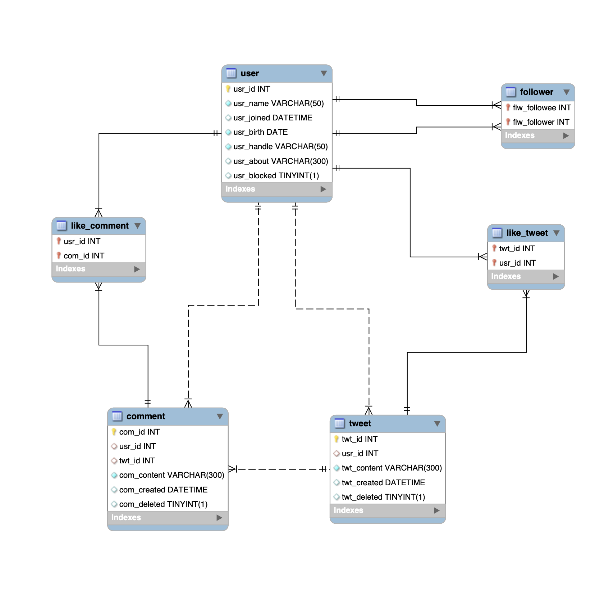

# Twitter Project

This project is a local Twitter clone built using Vue.js (Options API) for the frontend, Node.js for the backend, and MySQL for the database. It was built as a final project for the Java Script Frontend Developer course at the ITAcademy, in September of 2023. The project represents a simplified version of Twitter, where users can create an account, log in, post tweets, follow other users, and view their feed. It was never meant to be deployed to a production environment, but rather to showcase the skills learned during the course.

## Table of Contents

- [Installation](#installation)
- [Database Setup](#database-setup)
- [Running the Project](#running-the-project)
- [Project Structure](#project-structure)
- [Contributing](#contributing)
- [License](#license)

## Installation

1. Clone the repository:

   ```sh
   git clone https://github.com/yourusername/twitter_project.git
   cd twitter_project
   ```

2. Install the dependencies for both frontend and backend:
   ```sh
   cd frontend
   npm install
   cd ../backend
   npm install
   ```

## Database Setup

1. Install MySQL on your local machine if you haven't already.
2. Create a new database:

   ```sql
   CREATE DATABASE twitter_project;
   ```

3. Update the database configuration in the backend:

   ```js
   // backend/config/db.config.js
   module.exports = {
     HOST: "localhost",
     USER: "your_mysql_username",
     PASSWORD: "your_mysql_password",
     DB: "twitter_project",
   };
   ```

4. Create the necessary tables based on the provided EER diagram:



Use the EER diagram to manually create the tables in your MySQL database.

## Running the Project

1. Start the backend server:

   ```sh
   cd backend
   npm start
   ```

2. Start the frontend development server:

   ```sh
   cd frontend
   npm run serve
   ```

3. Open your browser and navigate to `http://localhost:8080`.

## Contributing

Contributions are welcome! Please fork the repository and create a pull request with your changes.

## License

This project is licensed under the MIT License.
